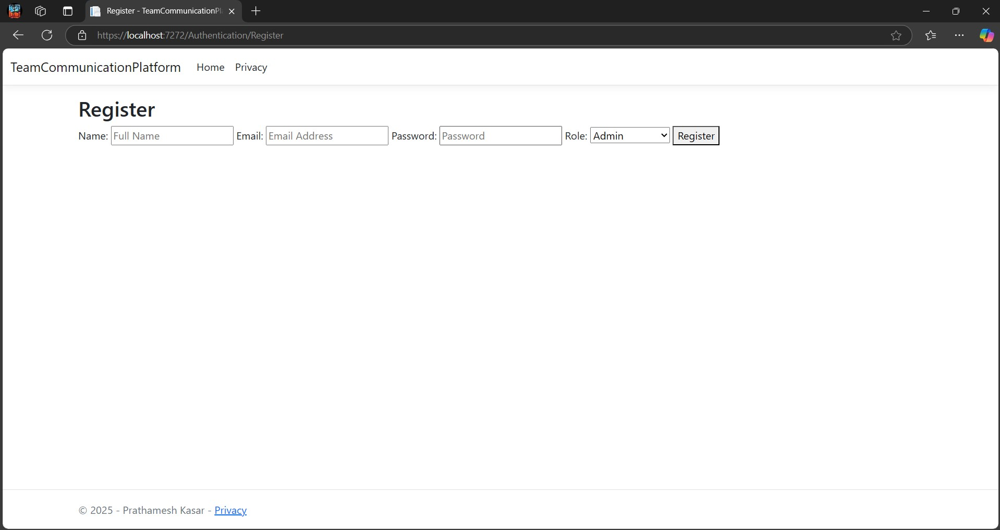
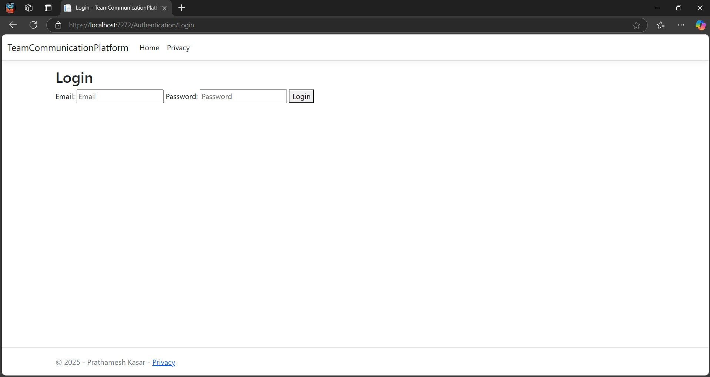
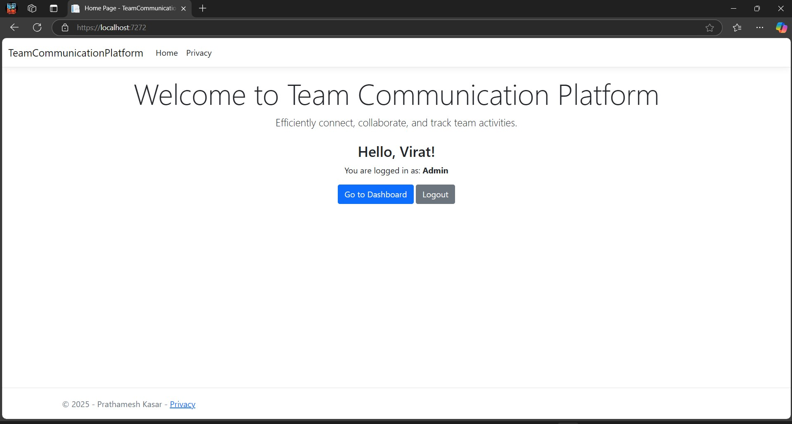
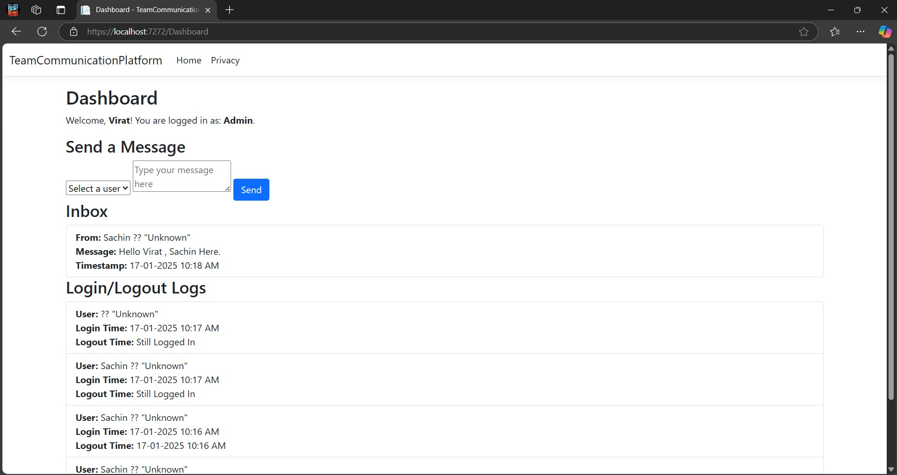
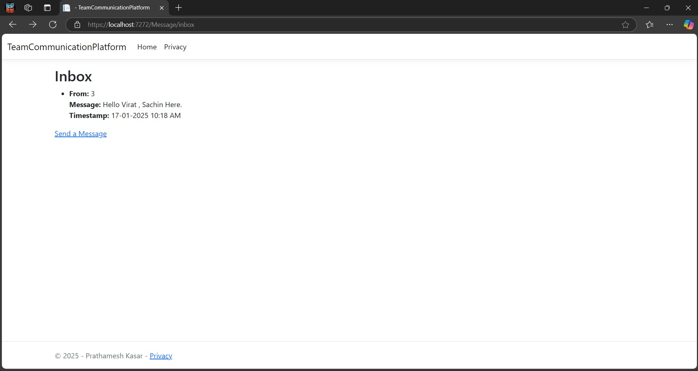

# TeamCommunicationPlatform

TeamCommunicationPlatform is a web application designed to facilitate team communication and collaboration. The platform allows users to send messages, manage user accounts, and track login/logout activities.

## Features

- **User Management**: Register, login, and logout functionality with session management.
- **Messaging**: Send and receive messages between users.
- **Dashboard**: Personalized user dashboard with inbox and activity logs.
- **Roles**: Different user roles, including Admin, Project Leader, and Programmer.

## Technologies Used

- **ASP.NET Core**: The backend framework for building the web application.
- **Entity Framework Core**: ORM for database interactions.
- **SQLite**: Database used to store user data, messages, and logs.
- **Razor Views**: Server-side rendered views for dynamic content.
- **Session Management**: User session management for handling logged-in users.

## Installation

### Prerequisites

Ensure you have the following installed:

- [.NET 8.0 SDK](https://dotnet.microsoft.com/download/dotnet/8.0)
- SQLite

### Clone the Repository

```bash
git clone https://github.com/01Prathamesh/TeamCommunicationPlatform.git

cd TeamCommunicationPlatform
```
### Install Dependencies

Run the following command to restore the necessary packages:

```bash
dotnet restore
```
### Configure the Database

The application uses SQLite for the database. To create the database and apply any migrations, run the following commands:

```bash
dotnet ef database update
```
OR

```bash
Add-Migration InitialCreate
Update-Database
```
### Run the Application
Run the application using the following command:

```bash
dotnet run
```
OR

```
Press F5
```
Once the application is running, you can access it at http://localhost:7272.

## URLs and Functionality

- https://localhost:7272/                         Home page of the application.
- https://localhost:7272/Authentication/Register   User registration page.
- https://localhost:7272/Authentication/Login      User login page.
- https://localhost:7272/Dashboard                 Role-based dashboard for logged-in users.
- https://localhost:7272/Message/Send              Send a message to another user.
- https://localhost:7272/Message/Inbox             View all messages received by the logged-in user.

## File Structure

```bash
TeamCommunicationPlatform/
│
├── Controllers/                # Contains controllers for handling requests
│   ├── AdminController.cs
│   ├── AuthenticationController.cs
│   ├── DashboardController.cs
│   ├── MessageController.cs
│
├── Models/                     # Contains models for users, messages, and logs
│   ├── TeamCommunicationContext.cs
│   ├── User.cs
│   ├── Message.cs
│   ├── UserLoginLog.cs
│
├── Views/                      # Contains Razor views for UI
│   ├── Home/
│   ├── Authentication/
│   ├── Message/
│   ├── Shared/
│
├── Migrations/                 # Contains migration files for the database schema
│
├── wwwroot/                    # Contains static files like CSS, JS, and images
│
├── TeamCommunication.db        # SQLite database file
├── TeamCommunication.db-shm    # SQLite shared memory file
├── TeamCommunication.db-wal    # SQLite write-ahead log file
└── TeamCommunicationPlatform.csproj  # Project configuration file
```

## Usage

*   **Login**: Use the `Login` page to log into the platform. You must provide a valid email and password.
*   **Register**: Use the `Register` page to create a new user account. Ensure the email is not already registered.
*   **Dashboard**: After logging in, users will be directed to the dashboard, where they can send messages, view received messages, and see login/logout activity.

## Contributing

Contributions are welcome! Please fork this repository, create a new branch, and submit a pull request with your proposed changes.

## License
This project is licensed under the MIT License. See [LICENSE](./LICENSE) for more details.


## Acknowledgements

*   ASP.NET Core for the web framework
*   Entity Framework Core for ORM support
*   SQLite for lightweight database management

## Screenshots

1. **Home Page (without user login)**  
   

2. **Register Page**  
   

3. **Login Page**  
   

4. **Home Page (after user login)**  
   

5. **User Dashboard Page**  
   

6. **Send Message Page**  
   

7. **Inbox Page**  
   
